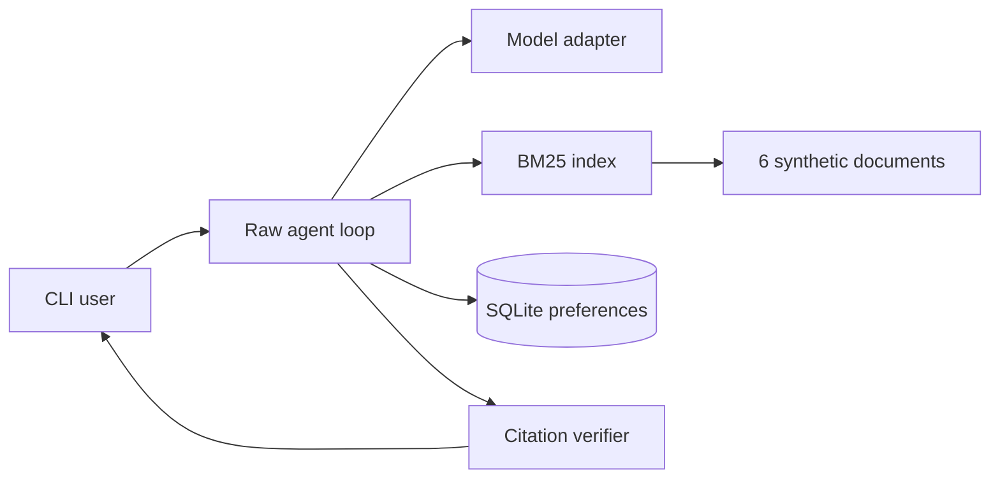

# Stateful Knowledge Agent — Reference Submission

This raw-SDK assistant combines bounded turn history, explicit durable preferences, local BM25 retrieval, verified citations, and abstention. The corpus is a deterministic six-document synthetic campus handbook generated locally with no external data.

## Run

```bash
python -m venv .venv && source .venv/bin/activate
pip install -r requirements.txt
python generate_corpus.py
pytest -q
python knowledge_agent.py --mock ask --user ada "When do residence quiet hours begin?"
python knowledge_agent.py --mock ask --user ada "I prefer concise answers"
python knowledge_agent.py --mock inspect --user ada
python knowledge_agent.py --mock forget --user ada --key detail_level
python run_evals.py
```

Omit `--mock` to use the official OpenAI SDK after exporting `OPENAI_API_KEY`. Generated documents, SQLite state, and traces remain local and are ignored by Git.

## Architecture



Ingestion normalizes Markdown into overlapping 150-word chunks with stable IDs based on document, position, and content. Re-running it produces the same unique IDs. BM25 returns up to five scored local chunks; no paid vector database or embedding call is used.

Short-term state is at most six recent user/assistant messages per session. Durable memory is an allowlist of `detail_level` and `preferred_topic`, keyed by user, with provenance and timestamp. Only a direct “I prefer…” statement authorizes the model's memory-write request. The CLI supports inspection and deletion.

Answers may cite only chunk IDs retrieved in that turn. An unknown question returns “not enough evidence”; an invented citation fails verification before display. Logs hash the user ID and record retrieval scores, memory events, latency, citations, and stop reason without hidden reasoning.

## Evaluation and results

The 15 cases include eight answerable questions, three unanswerable questions, two memory interactions, one update, and one cross-user isolation case. Deterministic mock results are:

- Retrieval/grounded-answer success: **8/8 (100%)**
- Abstention success: **3/3 (100%)**
- Memory/update/isolation success: **4/4 (100%)**

These numbers validate the example fixtures, not production generalization. Mock API spend is **$0.00**; live evaluation stays within the project estimate through short contexts and one run.

## Limitations and next steps

The generated corpus is deliberately repetitive and BM25 handles synonyms poorly. The mock synthesizer quotes one evidence sentence rather than producing polished prose. I would next compare lexical and embedding retrieval, add a memory expiration policy, and flag prompt-like instructions found inside documents.

