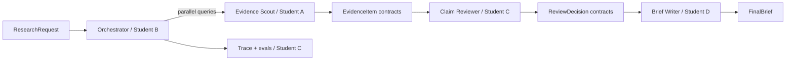

# Research Brief Studio — Group Reference Submission

Three bounded specialists turn a 10-document synthetic packet into a 600–900 word cited research brief. Evidence collection has a parallel step; review and synthesis are sequential. A plain Python orchestrator owns shared state, an eight-call budget, timeouts, and partial results.

## Run

```bash
python -m venv .venv && source .venv/bin/activate
pip install -r requirements.txt
pytest -q
python -m ui.cli --mock "What improves student retention?"
python -m ui.cli --mock --inject timeout "What improves retention?"
python -m evals.run_evals
```

The packet is synthetic and locally licensed for the example. Mock mode is the reference path and costs $0.00. The role boundaries are provider-independent; a live text-model adapter can replace deterministic extraction/synthesis without changing contracts.

## Architecture and roles



`MILESTONE.md` records the `integration-v1` contract test and ownership. The orchestrator deduplicates evidence, permits no implicit agent-to-agent calls, rejects malformed claims through review, surfaces timeouts, and produces partial status rather than inventing missing evidence.

## Evaluation

Twenty cases cover answerable, insufficient-evidence, conflict, embedded-injection, safety, and injected failures. The runner compares a single-agent baseline with the multi-agent path and reports task success, citation validity, unsupported-claim rate, p95 latency, and cost. The deterministic reference reaches 20/20 valid workflows, rejects the injected document, and costs $0.00; the baseline intentionally leaves unsupported claims for the comparison.

## Limitations and improvements

Lexical search and template synthesis are transparent but not fluent. The brief's implementation section is intentionally formulaic. I would next use the same contracts with a low-cost live model, add one reviewer-requested targeted search, and run an ablation that removes review. See `architecture_decision.md` for the current tradeoff.

